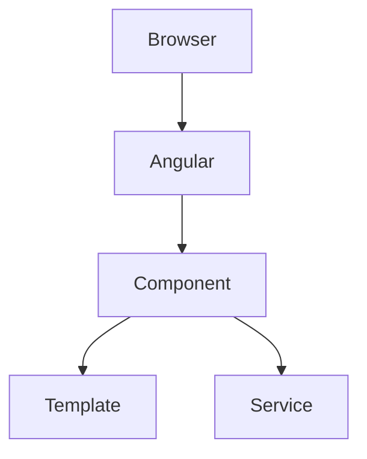

## comparing concepts use tabs
=== "TypeScript"

    ```typescript
    let name = "Jyothi";
    ```

=== "Java"

    ```java
    String name = "Jyothi";
    ```
---

## code blocks

```java
List<String> list = new ArrayList<>();
```

```sql
SELECT *
FROM employee
WHERE salary > 50000;
```
---

## beautiful notes

!!! tip "Interview Tip"

    Components should be small and reusable.
!!! warning

    Don't perform HTTP calls inside constructors.
!!! note

    ngOnInit executes once after Angular initializes the component.
---

## mermaid diagrams


---

## checklists

## Angular Interview Checklist

- [x] Components
- [x] Lifecycle
- [ ] Signals
- [ ] RxJS
- [ ] Standalone Components

---

## Tables

| Hook | Runs |
|------|------|
| constructor | Object creation |
| ngOnInit | Once |
| ngOnDestroy | Before destruction |

---